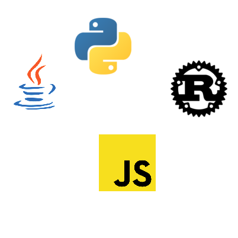
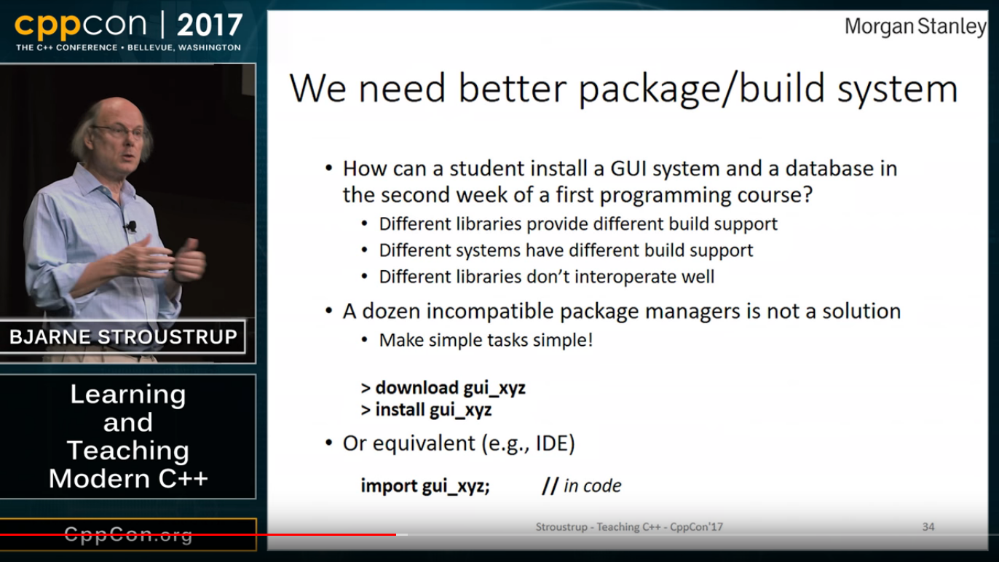
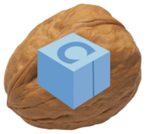
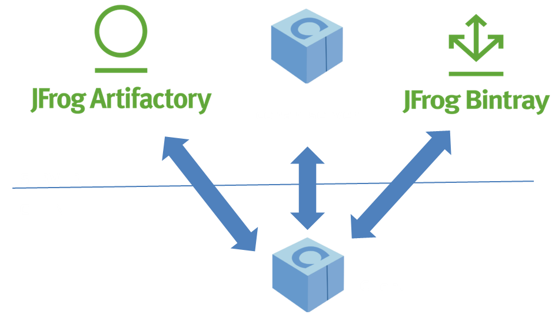
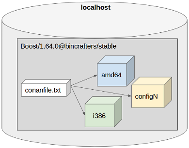
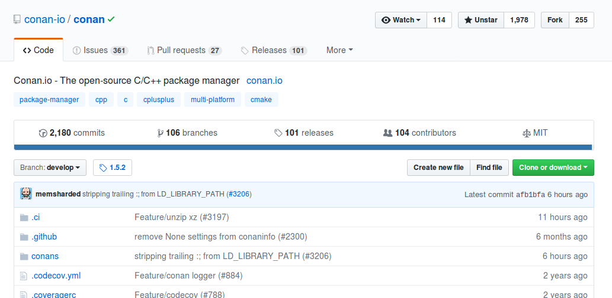
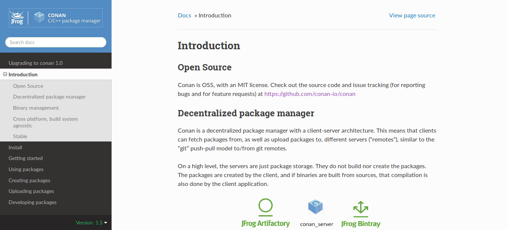
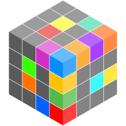

## Resolvendo Tretas com Conan.io

#### A ascenção e a queda do bárbaro


---?image=assets/img/lego-dark-green.png
@title[Sobre mim]

@div[left-70]
Olá!
<br>
<br>
**Uilian Ries**
<br>
<br>
Desenvolvedor C++ e Python
<br>
Trabalha para a **@jfrog**
<br>
<br>
Ex-Khompanheiro
<br>
<br>
@uilianries
<br>
@fa[github] @fa[twitter] @fa[linkedin]
@divend

@div[right-30]

@divend

---?image=assets/img/lego-dark-red.png

### PROJETOS POPULARES C/C++

##### Porque você precisa de boas bibliotecas

---?image=assets/img/lego-dark-blue.png
@title[A New Project]

Vamos começar um novo projeto C++!

O que precisamos?

@div[left-50]
<ul>
  <li>OpenSSL</li>
  <li>Qt</li>
  <li>Boost</li>
  <li>OpenCV</li>
  <li>POCO</li>
</ul>
@divend

---?image=assets/img/lego-dark-green.png

#### TODAS PRECISAM SER COMPILADAS

* Baixe o fonte, construa na sua máquina
  - Isso pode levar minutos, horas ou até dias
  - Podem haver dependências extras
  - Você precisa saber como construir o projeto

* Instalar utilizando o gerenciador de pacotes nativo
  - A versão disponível pode não ser a esperada
  - Pode ser necessário ainda aplicar um patch

---?image=assets/img/lego-dark-green.png

#### Compilar os fontes? Instalar pela distro?


---?image=assets/img/lego-dark-red.png

### GERENCIADOR DE PACOTES

##### Como evitar o *externals* no seu projeto

---?image=assets/img/lego-dark-green.png

#### GERENCIADORES DE PACOTES POPULARES

@div[left-50]
<br>
<ul>
  <li>Python</li>
  <ul>
    <li>pip, Conda</li>
  </ul>
  <li>Rust</li>
  <ul>
    <li>Cargo</li>
  </ul>
  <li>Java</li>
  <ul>
    <li>Maven</li>
  </ul>
  <li>JavaScript</li>
  <ul>
    <li>npm</li>
  </ul>
</ul>
@divend
@div[right-50]

@divend

---?image=assets/img/lego-dark-blue.png
@title[CppCon 2017]



Note:

- SG15, Tooling: modules and package management
- Paper P1067R0

---?image=assets/img/lego-dark-blue.png

#### UNIVERSO C++

@div[left-50]
<br>
<ul>
  <li>CONAN</li>
  <li>HUNTER</li>
  <li>BUCKAROO</li>
  <li>VCPKG</li>
  <li>CGET</li>
  <li>CPM</li>
<ul>
@divend
@div[right-30]

@divend

---?image=assets/img/lego-dark-red.png

## CONAN

Não o bárbaro!


---?image=assets/img/lego-dark-blue.png

#### CONAN

@div[left-70]
<br>
<ul>
  <li>FOSS</li>
  <li>Licença MIT</li>
  <li>Descentralizado como GIT</li>
  <li>Manipula fontes e binários</li>
  <li>Geradores para CMake, VS, XCode, qmake …</li>
  <li>Desenvolvido em Python</li>
  <li>+150 contribuidores</li>
  <li>+2K likes (Github)</li>
</ul>
@divend
@div[right-30]

@divend

---?image=assets/img/lego-dark-green.png

### INSTALAÇÃO

`$ pip install conan`

---?image=assets/img/lego-dark-red.png

### CONAN EM AÇÃO
@title[Conan in Action]

"Falar é fácil. Me mostre o código."


---?image=assets/img/lego-dark-green.png

#### CONAN EM AÇÃO
@title[Conan in Action File - Propose]

* Calcular MD5 utilizando Poco
* Verificar um string com Boost Regex
* Construir utilizando CMake


---?image=assets/img/lego-dark-green.png

#### CONAN EM AÇÃO
@title[Conan in Action - Project Structure]

```
example
|   main.cpp
|   conanfile.txt
|   CMakeLists.txt
```

---?image=assets/img/lego-dark-green.png

#### CONAN EM AÇÃO
@title[Conan in Action - main.cpp]

main.cpp

```cpp
#include <Poco/MD5Engine.h>
#include <boost/regex.hpp>
#include <iostream>

int main() {
    Poco::MD5Engine md5;
    md5.update("Hello World");
    std::string md5string = Poco::DigestEngine::digestToHex(md5.digest());
    std::cout << "MD5= " << md5string << '\n';

    boost::regex expr{R"(\w+\s\w+)"};
    std::cout << boost::regex_match("Hello World", expr) << '\n';
    return EXIT_SUCCESS;
}
```

@[6-9]
@[11-12]

---?image=assets/img/lego-dark-blue.png

#### CONAN EM AÇÃO
@title[Conan in Action - conanfile.txt]

conanfile.txt

```
[requires]
Poco/1.9.0@pocoproject/stable
boost/1.67.0@conan/stable

[generators]
cmake
```

@[1-3]
@[5-6]

---?image=assets/img/lego-dark-green.png

#### CONAN EM AÇÃO
@title[Conan in Action - CMakeLists.txt]

CMakeLists.txt - **COM FindXXX.cmake**

```cmake
cmake_minimum_required(VERSION 2.8)
project(example CXX)

find_package(Boost 1.67.0 REQUIRED regex)
find_package(Poco 1.9.0 REQUIRED Foundation)

add_executable(example main.cpp)
target_link_libraries(example ${Boost_LIBRARIES} ${Poco_LIBRARIES})
```

@[1-2]
@[4-5]
@[7-8]

---?image=assets/img/lego-dark-green.png

#### CONAN EM AÇÃO
@title[Conan in Action - CMakeLists.txt (Conan)]

CMakeLists.txt - **COM conanbuildinfo.cmake**

```cmake
cmake_minimum_required(VERSION 2.8)
project(example CXX)

include(${CMAKE_BINARY_DIR}/conanbuildinfo.cmake)
conan_basic_setup()

add_executable(example main.cpp)
target_link_libraries(example ${CONAN_LIBS})
```

@[1-2]
@[4-5]
@[7-8]

---?image=assets/img/lego-dark-green.png

#### CONAN EM AÇÃO
@title[Conan in Action - Conan Install]

Como Construir

`$ conan install .`

```
PROJECT: Installing /home/conan/project/conanfile.txt
Packages
    OpenSSL/1.0.2o@conan/stable:0abbb2ea17cdc92f4a2ac8a9e55de717e3b5a9d1
    Poco/1.9.0@pocoproject/stable:8a67b44a092c0074e3cb946a9ddada338054b11e
    boost/1.67.0@conan/stable:eacfdb5f448bfd89f0b2950fb6b7a79e44c7ea08
    bzip2/1.0.6@conan/stable:76f87539fc90ff313e0b3182641a9bb558a717d2
    zlib/1.2.11@conan/stable:d358fec34c04bcd89832a09158783c750a3304dc
PROJECT: Generator cmake created conanbuildinfo.cmake
PROJECT: Generated conaninfo.txt
```

---?image=assets/img/lego-dark-green.png

#### CONAN EM AÇÃO
@title[Conan in Action - Build]

Como construir

```
$ conan install .
$ cmake .
$ cmake --build .
$ bin/example
```

@[1]
@[2]
@[3]
@[4]

---?image=assets/img/lego-dark-blue.png

#### CONAN EM AÇÃO
@title[Conan in Action - The Result]

* Instalou Boost 1.67.0 compilado
* Instalou Poco 1.9.0 compilado
* CMake helper
* Funciona no Linux, Windows, Macos, FreeBSD, ...

---?image=assets/img/lego-dark-red.png

### CONAN NUMA CASCA DE NOZ

Como isso funciona.



---?image=assets/img/lego-dark-blue.png

#### COMPREENDENDO O CONAN

* Nomenclatura de pacotes
* Setup do sistema
* Distribuição de pacotes
* Cache local

---?image=assets/img/lego-dark-green.png

#### NOMENCLATURA DE PACOTES

**`name/version@user/channel`**

* Exemplos
  * Poco/1.9.0@pocoproject/stable
  * Boost/1.67.0@conan/testing
  * Qt/5.11.0@bincrafters/stable

---?image=assets/img/lego-dark-green.png

#### SETUP DO SISTEMA

* Baseado em perfils

**Definições do Conan + Configuração do host = Perfil**

---?image=assets/img/lego-dark-green.png

#### PERFIL

`$ conan profile show default`

```
Configuration for profile default:

[settings]
os=Linux
os_build=Linux
arch=x86_64
arch_build=x86_64
compiler=gcc
compiler.version=8
compiler.libcxx=libstdc++11
build_type=Release
[options]
[build_requires]
[env]
```

---?image=assets/img/lego-dark-green.png

#### DISTRIBUIÇÃO DE PACOTES

* Parecido com GIT
* Suporte a multiplos remotos
* Repositório central - JFrog Bintray
* Fácil de rodar um instância local
  * `$ conan_server`
* JFrog Artifactory pode ser utilizado junto

---?image=assets/img/lego-dark-red.png

#### DISTRIBUIÇÃO DE PACOTES



---?image=assets/img/lego-dark-green.png

#### LISTA DE REMOTOS

`$ conan remote list`

```
my-company: http://172.0.1.42:9300
conan-center: https://conan.bintray.com
bincrafters: http://api.bintray.com/conan/bincrafters/public-conan
```

---?image=assets/img/lego-dark-green.png

#### CACHE LOCAL

Pacotes Conan = **1** receita, **N** pacotes binários



---?image=assets/img/lego-dark-green.png

#### ID DO PACOTE

`$ conan search boost/1.67.0@conan/stable`

```
Existing packages for recipe boost/1.67.0@conan/stable:

    Package_ID: eacfdb5f448bfd89f0b2950fb6b7a79e44c7ea08
        [options]
            fPIC: False
            shared: False
        [settings]
            arch: x86_64
            build_type: Release
            compiler: gcc
            compiler.libcxx: libstdc++
            compiler.version: 5
            os: Linux
        [requires]
            bzip2/1.0.6@conan/stable:76f87539fc90ff313e0b3182641a9bb558a717d2
            zlib/1.2.11@conan/stable:d358fec34c04bcd89832a09158783c750a3304dc
```

---?image=assets/img/lego-dark-red.png

### CRIANDO PACOTES

Como uma receita se parece.

---?image=assets/img/lego-dark-green.png

#### CRIANDO PACOTES
@title[Creating Packages - conanfile.py]

```python
from conans import ConanFile, CMake, tools

class HelloConan(ConanFile):
    name = "hello"
    version = "0.1.0"
    settings = "os", "compiler", "build_type", "arch"
    generators = "cmake"

    def build(self):
        cmake = CMake(self)
        cmake.configure()
        cmake.build()
        cmake.install()

    def package_info(self):
        self.cpp_info.libs = ["hello"]
```

---?image=assets/img/lego-dark-green.png

#### CRIANDO PACOTES
@title[Creating Packages - Create]

`conan create . uilianries/testing`

```
hello/0.1.0@uilianries/testing: Exporting package recipe
hello/0.1.0@uilianries/testing: WARN: Forced build from source
hello/0.1.0@uilianries/testing: Installing package
Requirements
    hello/0.1.0@uilianries/testing from local cache - Cache
Packages
    hello/0.1.0@uilianries/testing:56e0cf6d16ee57367a0661ab743f4e43b29223f8 - Build

hello/0.1.0@uilianries/testing: Building your package in
hello/0.1.0@uilianries/testing: Copying sources to build folder
hello/0.1.0@uilianries/testing: Generator cmake created conanbuildinfo.cmake
...
```

---?image=assets/img/lego-dark-red.png

### COMUNIDADE

"Compartilhar dados é o primeiro passo em direção à comunidade."

---?image=assets/img/lego-dark-blue.png
@title[Github]

### github.com/conan-io/conan



---?image=assets/img/lego-dark-blue.png
@title[Conan docs]

### docs.conan.io



---?image=assets/img/lego-dark-blue.png
@title[plugins]

### EXTENSÕES

* [CLion](https://plugins.jetbrains.com/plugin/11956-conan)
* [Visual Studio](https://docs.conan.io/en/latest/integrations/ide/visual_studio.html)

---?image=assets/img/lego-dark-green.png
#### BINTRAY COMO CENTRAL PARA DOWNLOADS

* https://bintray.com/conan
* Solução da JFrog
* Conan Center: +200 receitas

---?image=assets/img/lego-dark-blue.png

#### BINCRAFTERS

@div[left-70]
<br>
<ul>
  <li>https://bincrafters.github.io</li>
  <li>Empacotando Software OSS</li>
  <li>~20 membros e crescendo</li>
  <li>+500 projetos, incluindo:</li>
  <ul>
    <li>Boost, Abseil, Azure, Qt</li>
  </ul>
  <li>Agradecimento para @solvingj, @SSE4, @grafikbot, @theirix, @madebr, @Croydon</li>
</ul>
@divend
@div[left-30]

@divend

---?image=assets/img/lego-dark-blue.png

#### AUTORES

Também mantido pelos autores oficiais:

* [Poco](https://github.com/pocoproject/poco)
  - Biblioteca C++ multi propósito
* [Ezored](https://github.com/ezored/ezored)
  - Toolkit C++ para desktop e mobile
* [Catch2](https://github.com/catchorg/Catch2)
  - Framework de teste header-only
* [Flatbuffers](https://github.com/google/flatbuffers)
  - Biblioteca para serialização

---?image=assets/img/lego-dark-green.png

#### SLACK

@div[left-70]
<br>
<ul>
  <li>https://cpplang.slack.com</li>
  <li>Canais</li>
  <ul>
    <li>#conan (+840 membros)</li>
    <li>#bincrafters (+200 membros)</li>
  </ul>
</ul>
@divend
@div[left-30]

@divend

---?image=assets/img/lego-dark-white.png

#### REFERÊNCIAS

* https://github.com/conan-io/conan
* https://github.com/bincrafters
* https://conan.io
* https://docs.conan.io
* https://github.com/conan-io/examples
* [CppCon 2016: Conan, a C and C++ package manager for developers](https://youtu.be/xvqH_ck-5Q8)
* https://bintray.com/conan
* [Programming C++ With The 4 Cs: Clang, Cmake, Clion And Conan](https://blog.conan.io/2016/05/10/Programming-C++-with-the-4-Cs-Clang,-CMake,-CLion-and-Conan.html)

---?image=assets/img/lego-dark-white.png

### OBRIGADO!

##### Perguntas, Dúvidas, Curiosidades ?

Você pode me encontrar em:

**@uilianries** - twitter, github
cpplang.slack.com - canais #conan or #bincrafters
uilianries@gmail.com
https://conan.io
