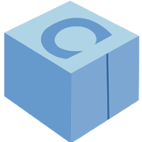

## Resolvendo Tretas com Conan.io

#### A Ascenção e a Queda do Bárbaro



---?image=assets/img/lego-dark-blue.png

#### LINK DESTA APRESENTAÇÃO

http://bit.ly/3aL13xc

https://gitpitch.com/uilianries/gitpitch-conan-tretas

---?image=assets/img/lego-dark-green.png
@title[Sobre mim]

@div[left-70]
Olá!
<br>
<br>
**Uilian Ries**

<br>
<br>
Desenvolvedor C++ e Python
<br>
Trabalha para a **@jfrog**
<br>
<br>
Ex-Khomp (01/17 - 09/18)
<br>
<br>
@uilianries
<br>
@fa[github] @fa[twitter] @fa[linkedin]
@divend

@div[right-30]

@divend

---?image=assets/img/lego-dark-blue.png

#### CONAN

@div[left-70]
<br>
<ul>
  <li>FOSS</li>
  <li>Licença MIT</li>
  <li>Descentralizado como GIT</li>
  <li>Manipula fontes e binários</li>
  <li>Geradores para CMake, Visual Studio, pkgconfig …</li>
  <li>Desenvolvido em Python</li>
  <li>+180 contribuidores</li>
  <li>Versão Atual 1.21.1 (Jan/2020)</li>
</ul>
@divend
@div[right-30]

@divend

---?image=assets/img/lego-dark-red.png

#### SOBRE ESTA APRESENTAÇÃO


- Apresentar novas features
- Discutir os sintomas do Dev
- Não haverá introdução ao Conan:
  - https://gitpitch.com/uilianries/gitpitch-conan
  - https://docs.conan.io/en/latest/videos.html

---?image=assets/img/lego-dark-red.png

#### TÓPICOS DESTA APRESENTAÇÃO

- Deploy generator
- Deploying packages
- Hooks
- Python requires
- conandata.yml
- Package Revisions
- Lockfiles
- Editable packages
- Workflows
- Conan Center Index
- Conan Days

---?image=assets/img/lego-dark-green.png

#### DEPLOY GENERATOR

    conan install . -g deploy

- Quando precisar instalar tudo em apenas um lugar
- Copiar todos os artefatos para o diretório atual
- Não vai para a cache do Conan
- Útil quando precisar empacotar para o cliente

---?image=assets/img/lego-dark-blue.png

#### DEPLOYING PACKAGES

```python
    def deploy(self)
        self.copy("foo", dst="bin", src="bin")
```

    conan create . user/testing

- Mesmo efeito que o gerador Deploy, porém
  já definido na receita.

---?image=assets/img/lego-dark-green.png

#### HOOKS

https://github.com/conan-io/hooks

- Função Python que será executada em meio ao fluxo de trabalho
- Não modifica o cliente Conan ou as receitas
- Útil para executar passos customizados
- Exemplos: pylint na receita, disparar CI depois do upload

---?image=assets/img/lego-dark-green.png

#### HOOKS

- Criar um script Python, utilizando os métodos suportados

```python
# ~/.conan/hooks/check_settings.py

def pre_export(output, conanfile, conanfile_path, reference, **kwargs):
    settings = getattr(conanfile, "settings")
    if settings and "cppstd" in settings:
        raise ConanException("The 'cppstd' setting is deprecated.")
```

---?image=assets/img/lego-dark-green.png

#### HOOKS

- Métodos suportados (não todos):
  - pre_export
  - post_export
  - pre_source
  - post_source
  - pre_build
  - post_build
  - pre_package
  - post_package
  - pre_upload

---?image=assets/img/lego-dark-green.png

#### HOOKS

Para ativar um hook:

    conan config set hooks.check_settings

Para desativar um hook:

    conan config rm hooks.check_settings

---?image=assets/img/lego-dark-blue.png

#### PYTHON REQUIRES

- Permite compartilhar código e arquivos entre diferente receitas
- Útil para não precisar reescrever mesmo trecho
- Existe uma versão legado desta feature!

---?image=assets/img/lego-dark-blue.png

#### PYTHON REQUIRES

```python
# conanfile.py
from conans import ConanFile

myvar = 123

def myfunct():
    return 234

class Pkg(ConanFile):
    pass
```

    conan export . pyreq/0.1@user/channel

---?image=assets/img/lego-dark-blue.png

#### PYTHON REQUIRES

```python
from conans import ConanFile

class Pkg(ConanFile):
    python_requires = "pyreq/0.1@user/channel"

    def build(self):
        v = self.python_requires["pyreq"].module.myvar
        f = self.python_requires["pyreq"].module.myfunct()
        self.output.info("%s,%s" % (v, f))
```

---?image=assets/img/lego-dark-blue.png

#### PYTHON REQUIRES

Extendendo classes

```python
from conans import ConanFile

class MyBase(ConanFile):
    name = "base"
    version = "0.1.0"

    def source(self):
        self.output.info("no creo en las brujas")
    def build(self):
        self.output.info("pero que las hay las hay")
```

    conan export . user/channel

---?image=assets/img/lego-dark-blue.png

#### PYTHON REQUIRES

```python
from conans import ConanFile

class Pkg(ConanFile):
    name = "pkg"
    version = "0.1.0"
    python_requires = "base/0.1.0@uilianries/testing"
    python_requires_extend = "base.MyBase"

    def source(self):
        self.output.info("Miguel de Cervantes")
```

    conan create . pkg/0.1.0@user/channel

```
...
pkg/0.1@user/channel: Miguel de Cervantes
pkg/0.1@user/channel: pero que las hay las hay
```

---?image=assets/img/lego-dark-red.png

#### CONAN DATA (conandata.yml)

- Arquivo YAML carregado automaticamente pela receita
- Pode ser acessado através do atributo `conan_data`
- Útil quando uma mesma receita é utilizada para qualquer nova versão

---?image=assets/img/lego-dark-red.png

#### CONAN DATA (conandata.yml)

```yml
sources:
  1.0.0:
    url: "https://ftp.org/release/pkg-1.0.0.tar.gz"
    sha256: "430ae8354789de4fd19ee52f3b1f739e1f"
  1.0.1:
    url: "https://ftp.org/release/pkg-1.0.1.tar.gz"
    sha256: "d73a8da01e8bf8c7eda40b4c849150"
patches:
  1.0.0:
    patches: "0001-windows-build.patch"
  1.0.1:
    patches: []
```

---?image=assets/img/lego-dark-red.png

#### CONAN DATA (conandata.yml)

```python
class Foo(ConanFile):
    name = "pkg"

    def source(self):
        tools.get(**self.conan_data["sources"][self.version])
        for patch in self.conan_data["patches"][self.version]:
            tools.patch(**patch)
```

    conan create . pkg/1.0.0@user/channel

---?image=assets/img/lego-dark-green.png

#### PACKAGE REVISION

- Imutabilidade de pacotes
- Os pacotes em um servidor nunca são substituídos
- Receitas possuem sua propria revisão (RREV)
- Pacotes possuem sua propria revisão (PREV), que são ligadas ao RREV
- Por padrão, sempre a última revisão é instalada
- No cache do cliente, há apenas uma revisão instalada simultaneamente

---?image=assets/img/lego-dark-green.png

#### PACKAGE REVISION

Revisões podem ser fixadas quando você escreve uma referência:

Última revisão (RREV) disponível (padrão):

    lib/1.0@conan/stable

Revisão específica (RREV):

    lib/1.0@conan/stable#RREV

---?image=assets/img/lego-dark-green.png

#### PACKAGE REVISION

Revisões podem ser fixadas quando você escreve uma referência (continuação):

Pacote que pertence a uma revisão específica (RREV):

    lib/1.0@conan/stable#RREV:PACKAGE_ID

Revisão pacote específica (PREV) que pertence a uma revisão específica RREV:

    lib/1.0@conan/stable#RREV:PACKAGE_ID#PREVs

---?image=assets/img/lego-dark-green.png

#### PACKAGE REVISION

Por padrão, a revisão de pacotes **NÃO** está habilitada, para tal:

    conan config set general.revisions_enabled=1

Ou, através da variável de ambiente:

    export CONAN_REVISIONS_ENABLED=1

---?image=assets/img/lego-dark-green.png

#### PACKAGE REVISION

Modos de revisão

Poder ser alterado através do atributo `revision_mode` na receita

- **hash** (padrão): O hash de soma de verificação do manifesto será usado como revisão da receita
- **scm**: O SHA-1 do commit será usado como revisão da receita

---?image=assets/img/lego-dark-green.png

#### PACKAGE REVISION

Versão necessária pelo servidor:

- conan_server >= 1.13
- Artifactory >= 6.9
- Bintray (qualquer versão)

---?image=assets/img/lego-dark-blue.png

#### LOCKFILES

- Arquivos com um gráfico de dependência, incluindo:
  - as versões exatas
  - revisões
  - opções
  - configuração desse gráfico de dependência
- É o *pip freeze* do Conan
- Útil para obter compilações determinísticas

---?image=assets/img/lego-dark-blue.png

#### LOCKFILES

Utilizando o lockfile

```ini
# conanfile.txt
[requires]
zlib/1.2.11
```

    conan install .

```
zlib/1.2.11: Package installed 6af9cc7cb931c5ad942174fd7838eb655717c709
zlib/1.2.11: Downloaded package revision 4c5a825d90e0aec90feebe62f3e60a7b
conanfile.txt: Generator txt created conanbuildinfo.txt
conanfile.txt: Generated conaninfo.txt
conanfile.txt: Generated graphinfo
```

---?image=assets/img/lego-dark-blue.png

#### LOCKFILES

Estrutura do arquivo gerado, `conan.lock`:

```json
{
 "profile_host": "[settings]\narch=x86_64\narch_build=x86_64\nbuild_type=Release\ncompiler=gcc\ncompiler.libcxx=libstdc++\ncompiler.version=9\nos=Linux\nos_build=Linux\n[options]\n[build_requires]\n[env]\n",
 "graph_lock": {
  "nodes": {
   "0": {
    "pref": null,
    "options": "zlib:fPIC=True\nzlib:minizip=False\nzlib:shared=False",
    "requires": {
     "zlib/1.2.11#419994c54789da229ef991be6c2563b3": "1"
    },
    "path": "/tmp/python_requires/conanfile.txt"
   },
   "1": {
    "pref": "zlib/1.2.11#419994c54789da229ef991be6c2563b3:6af9cc7cb931c5ad942174fd7838eb655717c709#4c5a825d90e0aec90feebe62f3e60a7b",
    "options": "fPIC=True\nminizip=False\nshared=False"
   }
  }
 },
 "version": "0.2"
}
```

---?image=assets/img/lego-dark-blue.png

#### LOCKFILES

Instalando pacotes a partir do lockfile:

    conan install . --lockfile

O mesmo argumento `--lockfile` pode ser utilizado para os comandos:

- install
- create
- export
- info

---?image=assets/img/lego-dark-blue.png

#### LOCKFILES

Comando `conan graph`, gera e manipula lockfiles

Gerar lockfile sem precisar instalar os binários:

    conan graph lock

Atualizar o lockfile com informações de um novo:

    conan graph update-lock

Saber a ordem de build a partir de um lockfile

    conan graph build-order

---?image=assets/img/lego-dark-blue.png

#### LOCKFILES

Lockfiles + CI

Muito longo para apresentar aqui

https://docs.conan.io/en/latest/versioning/lockfiles.html#how-to-use-lockfiles-in-ci

https://github.com/conan-io/examples/tree/master/features/lockfiles/ci

---?image=assets/img/lego-dark-red.png

#### EDITABLE PACKAGES

- Quando você tem um projeto grande, onde:
  - Cria um ou mais apps
  - E esses apps dependem de várias bibliotecas internas
  - Essas bibliotecas são desenvolvidas sob o mesmo projeto
- O `conan create` se torna muito lento nesse contexto quando ocorre alguma mudança
- [Package Development Flow](https://docs.conan.io/en/latest/developing_packages/package_dev_flow.html) é muito custoso também

---?image=assets/img/lego-dark-red.png

#### EDITABLE PACKAGES

A ideia está em ligar o diretório dos artefatos (headers, libs e binários),
através de uma referência de pacote

Para qualquer nova mudança em uma biblioteca, não será necessário empacotar
novamente através do `conan create`

---?image=assets/img/lego-dark-red.png

#### EDITABLE PACKAGES

Construindo a lib

```
|- app/
|  |- hello.cpp
|  |- CMakeLists.txt
|  |- conanfile.txt
|
|- lib/
|  |- say.h
|  |- say.cpp
|  |- CMakeLists.txt
|  |- conanfile.py
```

    conan create lib/ say/0.1.0@user/channel

---?image=assets/img/lego-dark-red.png

#### EDITABLE PACKAGES

Construindo o app

    cd app/
    mkdir build
    cd build/
    conan install ..
    cmake ..
    cmake --build .
    ./hello
    Hello World!


---?image=assets/img/lego-dark-green.png

#### CONAN CENTER INDEX

https://github.com/conan-io/conan-center-index

- Lançado em 09/2019
- Centralização de todos os pacotes Conan
  - Absorção em maior parte do Bincrafters
  - Sobreposição de receitas mantidas por autores
  - Lembra o fluxo do Microsoft VCPKG
- Pacotes não mais portarão *namespace* em sua referência
  - e.g. zlib/1.2.11
  - Feature requer Conan >= 1.18.0

---?image=assets/img/lego-dark-green.png

#### CONAN CENTER INDEX

- Base de pesquisa através do https://conan.io/center
- O interessado, abre um PR apenas com a receita e pronto
  - Anteriormente, era necessário cada um manter a integração
    contínua própria e submeter para Bintray cada pacote.
  - Contudo, existem regras de qualidade que limitam a
    liberdade de cada receita.

---?image=assets/img/lego-dark-green.png

#### CONAN DAYS


http://bit.ly/2TU94Ki

- Madri, 19/03 e 20/03, 2020
- Talks de empresas e suas experiências
- Treinamentos e feedback das empresas
- Ingresso variam entre €50 e €450

---?image=assets/img/lego-dark-red.png

#### WHEEL OF PAIN


Vamos discutir os sintomas do Dev:

- Quais as maiores barreiras atuais?
- Como está sendo utilizado?
  - Receitas internas apenas?
  - Build from sources sempre?
- O que o Dev deseja da ferramenta?

---?image=assets/img/lego-dark-white.png

#### REFERÊNCIAS

* https://github.com/conan-io/conan
* https://github.com/bincrafters
* https://conan.io/center
* https://docs.conan.io
* https://github.com/conan-io/examples
* https://blog.conan.io

---?image=assets/img/lego-dark-white.png

### OBRIGADO!

##### PERGUNTAS, DÚVIDAS, CURIOSIDADES ?

Você pode me encontrar em:

**@uilianries** - twitter, github
cpplang.slack.com - canais #conan or #bincrafters
uilianries@gmail.com
https://conan.io
